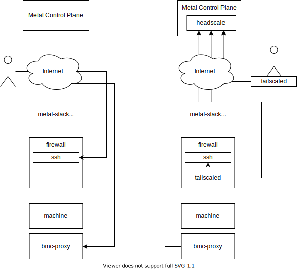

# No Open Ports To the Data Center

Our metal-stack partitions typically have open ports for metal-stack native services, these are:

- SSH port on the firewalls
- bmc-reverse-proxy for serial console access through the metal-console
- Access to the API servers of different storage solutions from controllers running in the control plane

These open ports are potential security risks. For example, while SSH access is possible only with private key it's still vulnerable to DoS attack.

Therefore, we want to get rid off these open ports to reduce the attack surface to the data center.

## Requirements

- Access to firewall SSH only via VPN
- Easy to update VPN components

As a next step, we can also consider joining the management servers to the VPN mesh, which would replace typical WireGuard setups for operators to enter resources inside the partition.

## High Level Design



> Simplified drawing showing old vs. new architecture.

### Concerns

There's few concerns when using WireGuard for implementing VPN:

1. WireGuard doesn't implement dynamic cipher substitution. Which is important in case one of the crypto methods, used by WireGuard will be broken. The only possible solution for that will be to update WireGuard to a fixed version.
2. Coordination server(Headscale) is a single point of failure. In case it fails, it potentially can disconnect existing members of the network, as WireGuard can't manage dynamic IPs by itself.
3. Headscale is already falls behind Tailscale coordination server implementation. Which can complicate the upgrade to newer version of Tailscale client in case of emergency.

### Solutions to concerns

1. Tailscale node software is using userspace implementation of WireGuard -- `wireguard-go`. One of the options is to inject Tailscale client into `metalctl`. And make it available as `metalctl vpn` or similar command. It should be possible to do as `tailscale` node is already available as open sourced Go pkg. That would allow us to control, what version of Tailscale users are using and in case of any critical changes to enforce them to update `metalctl` to use VPN functionality.
2. Would it be a considerable risk? We could look into `wg-dynamic` project to cover this problem.
3. At the moment, repository looks well maintained and the metal-stack team already contributes to it.

## Implementation Details

### metal-roles

`metal-roles` will be responsible for deployment of `headscale` server(via new `headscale` role). It also should provide sufficient config to `metal-api` so it establishes connection with `headscale` gRPC server.

### New `metalctl` commands

`metalctl` will be responsible for client-side implementation of this MEP. Specifically, it's by using `metalctl` user expected to connect to firewalls.

- `metalctl vpn` -- section for VPN related commands:
  - `metalctl vpn get key [vpn name] --namespace [namespace name]` -- returns auth key to be used with `tailscale` client for establishing connection.

Extend `metalctl firewall`:

- `metalctl firewall ssh [ID]` -- connect to firewall via SSH.

Extend `metalctl machine`:

- `metalctl machine ssh [ID]` -- connect to machine via SSH.

`metalctl` will be able to connect to firewall and machines by running `tailscale` in container.

### metal-api

Updates to `metal-api` should be made, so that it's able to add firewalls to VPNs. There should be one Tailscale namespace per project. So if multiple firewalls are created in single project, they will join the same namespace.

Two new flags should be introduced to connect `metal-api` to `headscale` gRPC server:

- `headscale-addr` -- specifies address of Headscale grpc API.
- `headscale-api-key` -- specifies temporary API key to connect to Headscale. It should be replaced and then rotated by `metal-api`.

If `metal-api` initialized with `headscale` connection it should automatically join all created firewalls to VPN.

Add new endpoint, that will be used by `metalctl` to connect to VPN:

- `/v1/vpn GET` -- requests auth key from `headscale` server.

### metal-hammer

`metal-hammer` acts as an intermediary for machine configuration between `metal-api` and machine's image. Specifically it writes to `/etc/metal/install.yaml` file, data from which later will be used by image's `install.sh` file.

To implement VPN support we have to add authentication key and VPN server address to `install.yaml` file. This key will be used to join machine to a VPN.

### metal-images

Images `install.sh` script have to be updated to work with authentication key and VPN server address, provided in `install.yaml` file. If this key is present, machine should connect to VPN.

### metal-networker

`metal-networker` also have to know if VPN was configured. In that case we need to disable public access to SSH and allow all(?) traffic from WireGuard interface.

### firewall-controller

`firewall-controller` have to monitor changes in `Firewall` resource and keep `tailscaled` version up-to-date.

### Resources

Update `Firewall` resource to include desired/actual `tailscale` version:

```yaml
Firewall:
  Spec:
    tailscale:
      Version:   Minimal version
    ...
  Status:
    ...
    VPN:
      Status:    Boolean field
    tailscale:
      Version:   Actual version
    ...
```

### bmc-reverse-proxy

TODO

## References

1. [WireGuard: Next Generation Secure Network Tunnel](https://www.youtube.com/watch?v=88GyLoZbDNw)
2. [How Tailscale works](https://tailscale.com/blog/how-tailscale-works)
3. [Tailscale is officially SOC 2 compliant](https://tailscale.com/blog/soc2)
4. [Why not Wireguard](https://www.ipfire.org/blog/why-not-wireguard)
5. [Wireguard: Known Limitations](https://www.wireguard.com/known-limitations/)
6. [Wireguard: Things That Might Be Accomplished](https://www.wireguard.com/todo/)
7. [Headscale: Tailscale control protocol v2](https://github.com/juanfont/headscale/issues/526)
