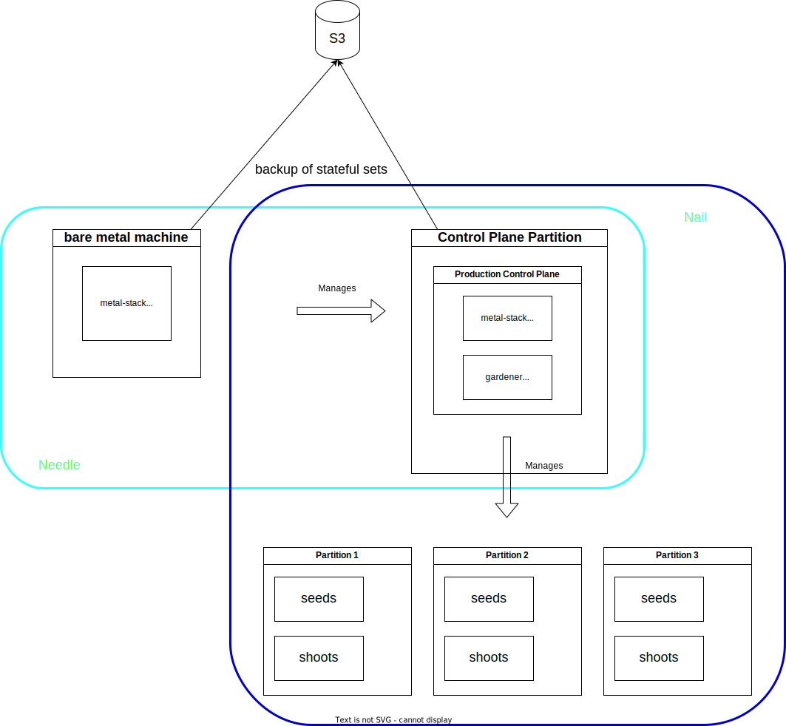

# Autonomous Control Plane

As described in the [deployment chapter](../../../installation/deployment.md), we strongly recommend Kubernetes as the target platform for running the metal-stack control plane.

Kubernetes clusters for this purpose are readily available from hyperscalers, metalstack.cloud, or other cloud providers. Simply using a managed Kubernetes cluster greatly simplifies a metal-stack installation. However, sometimes it might be desirable to host the metal-stack control plane autonomously, without the help of another cloud provider. Reasons for this might include corporate policies that prohibit the use of external data center products, or network constraints.

The Kubernetes cluster hosting the metal-stack control plane must provide at least the following features:

- Load balancing (for exposing the APIs)
- Persistent storage (for the databases and key-value stores)
- Access to object storage for automated backups of the stateful sets
- Access to a DNS provider supported by one of the used DNS extensions
- Externally accessible DNS records for obtaining officially signed certificates through DNS challenges

This metal-stack control plane cluster must also be highly available to prevent a complete loss of control over the managed resources in the data center.
Regular Kubernetes updates to apply security fixes and feature updates must be possible in an automated manner. The Day-2 operational overhead of running this cluster in your own datacenter must be reasonable.

In this chapter, we propose a solution for setting up a metal-stack environment with an autonomous control plane that is independent of another cloud provider.

```@contents
Pages = ["autonomous-control-plane.md"]
Depth = 5
```

## Use Your Own Dogfood

The most obvious solution is to just deploy a Kubernetes cluster manually in your own data center by utilizing existing tooling for the deployment:

- k3s
- kubeadm
- vmware and rancher
- talos
- kubespray
- ... (not a complete list)

However, all these solutions add another layer of complexity that needs to be maintained and operated by people who also need to learn and understand metal-stack. In general, metal-stack in combination with [Gardener](https://gardener.cloud) contains all the necessary tools to provide KaaS, so it makes sense to reuse what is already in place without introducing new dependencies on other products and vendors.

The only problem here is that Gardener is not yet able to create an initial cluster, which may change with the implementation of [GEP-28](https://github.com/gardener/gardener/blob/master/docs/proposals/28-autonomous-shoot-clusters.md). In the meantime, we suggest using [k3s](https://k3s.io/), which manages the initial metal-stack partition to host the control plane, since the maintenance overhead is acceptable and it is easy to deploy.

## The Matryoshka Principle

Instead of directly using the K3s cluster for the production control plane, we propose using it as a minimal control plane cluster which only purpose is to host the production control plane cluster. This layer of indirection brings some reasonable advantages:

- In the event of an interruption or loss of this minimal control plane cluster, the production control plane remains unaffected, and end users can continue to manage their clusters as normal.
- A dedicated operations team can take care of the Day-2 maintenance of this installation, which can be handy because the tools like k3s are a little different from the rest of the setup (it is likely that more manual maintenance is required than for any other cluster). This would also be true if the initial cluster problem would be solved by the Gardener itself and not using k3s.
- Since the number of shoot clusters to host is static, the resource requirements are minimal and will not change significantly over time. There are no huge resource requirements in terms of cpu, memory and storage. As such, the lack of scalability is not such a big issue.

So, our proposal is to chain two metal-stack control planes. The initial control plane cluster would use k3s and on this cluster we can spin up a cluster for the production control plane with the use of Gardener.

The following figure shows how the high-level architecture of this setup looks like. A even more simplified illustration of this setup can be looked up in the appendix[^1].


The k3s nodes can either be bare metal machines or virtual machines. When using VMs a single k3s node might be a viable solution, too. These nodes are supposed to be setup manually / partly automated with an operating system like Debian.

To name the cluster that hosts the initial metal-stack control plane and Gardener we use the term _initial cluster_. The initial cluster creates worker nodes to host the _target cluster_.

## Initial Cluster

The initial cluster is kept very small. The physical bare metal machines can be any machines and switches which are supported by metal-stack, but can be smaller in terms of cpu, memory and network speed because these machines must only be capable of running the target cluster for the metal-stack control plane. A typical single socket server with 8-16 cores and 64GB of RAM and two NVMe drives of 1TB would be a good starting point.

In a typical k3s setup, a stateful set would lose the data once the k3s cluster was terminated and started again. But there is a possibility to define parts of the local storage of the server to be provided to the k3s cluster for the PVCs. With that, k3s could be terminated and started again, for example to update and reboot the host os, or update k3s itself and the data will persist.

Example k3s configuration for persistent storage on the hosts os:

```yaml
k3s: Cluster
apiVersion: k3s.x-k8s.io/v1alpha4
name: needle-control-plane
nodes:
- role: control-plane
  # add a mount from /path/to/my/files on the host to /files on the node
  extraMounts:
  - hostPath: /path/to/my/files
    containerPath: /files
```

Into this cluster metal-stack and Gardener will be deployed. This deployment can be done by a Gitlab runner which is running on this machine.
The mini-lab will be used as a base for this deployment. The current development of [gardener-in-minilab](https://github.com/metal-stack/mini-lab/pull/202) must be extended to host all required extensions to make this a working metal-stack control plane which can manage the machines in the attached bare metal setup.

In addition to the metal-stack and Gardener deployment, some additional required services are deployed (non-complete list):

- PowerDNS to serve as a DNS Server for all DNS entries used in the initial and the target cluster, like `api.initial.metal-stack.local`, `gardener-api.initial.metal-stack.local` and the DNS entries for the api servers of the created kubernetes clusters.
- NTP
- Monitoring for the initial cluster and partition
- Optional: OIDC Server for authenticating against the metal-api
- Optional: Container Registry to host all metal-stack and gardener containers
- Optional: Let's Encrypt [boulder](https://github.com/letsencrypt/boulder) as a certificate authority
- ...

Physical view, minimal setup for a initial cluster with a single physical node:


Physical View, bigger ha setup which is spread across two data centers:


### Control Plane High Availability

Running the initial control plane on a single physical server is not as available as it should be in such a use case. It should be possible to survive a loss of this server, because the server could be lost by many events, such as hardware failure, disk corruption or even failure of the datacenter location where this server is deployed.

Setting up a second server with the same software components is an option, but the problem of data redundancy must be solved, because neither the gardener control plane, nor the metal-stack control plane can be instantiated twice.

Given that we provide part of the local storage of the server as backing storage for the stateful sets in the k3s cluster, the data stored on the server itself must be replicated to another server and backed up on a regular basis.

The replication of ETCD can be achieved through [clustered configuration](https://docs.k3s.io/datastore/ha-embedded) of k3s. Components of metal-stack and Gardener can run standalone and already utilize backup-restore mechanism that must be configured accordingly. For two or more bare metal machine used for the initial cluster, a loadbalancing mechanism for the ingress is required. kube-vip could be a possible solution.

For monitoring a backend like a Victoria Metrics Cluster would allow spearding the monitoring data across the initial cluster nodes. These metrics should also be backed up in object storage.

### Partition

The partition which is managed by the initial cluster can be a simple and small hardware setup but yet capable enough to host the target cluster. It would even be a good practice to create separate target clusters on the initial cluster, e.g. one for the metal-stack control plane and one for the Gardener (maybe one more for monitoring).

It can follow the metal-stack minimal setup which provides about 8-16 small servers connected to a 1G/s or 10G/s network dataplane. Central storage is optional as the persistence of the services running in these clusters is always backed up to a central object storage. Operations would be much easier if a central storage is provided.

## Target Cluster

The target cluster is the metal-stack environment which serves for end-user production use, the control plane is running in a shoot hosted in the initial cluster. The seed(s) and shoot(s) for end-users are created on the machines provided by the target cluster.
These machines can be of a different type in terms of size, but more importantly, these machines are connected to another network dataplane. Also the management infrastructure is separated from the initial cluster management network.

## Failure Scenarios

Everything could fail, everything will fail at some point. But this must kept in mind and nothing bad should happen if only one component at a time fails.
If more than one fails, the restoration to a working state must be easily possible and well documented.

To ensure all possible breakages are documented, we suggest writing a list which summarizes all failure scenarios that might occur including the remediation.

Here is an example of how a scenario documentation could look like:

**Scenario**: Initial cluster is gone, all machines have died
**Impact**: Management of the initial cluster infrastructure not possible anymore, the target cluster continues to run but cannot be managed because the API servers are gone. end-users are not affected by this incident.
**Remediation**: The initial cluster nodes must be provisioned from scratch and re-deployed through the CI mechanism. The backups of the stateful sets are automatically restored during this process.

## Implementation

As part of this proposal, we provide the following tools and integrations in order to setup an autonomous control plane:

- Deployment roles for the services like PowerDNS and NTP for the initial cluster
- Stretch goal: Deployment role to setup k3s in clustered configuration for the initial cluster and update it
- Extend the Gardener on mini-lab integration to allow shoot creation in the mini-lab
- Steady integration of the setup (maybe something like [k3d](https://github.com/k3d-io/k3d) in the mini-lab)

## Appendix

[^1]: 
