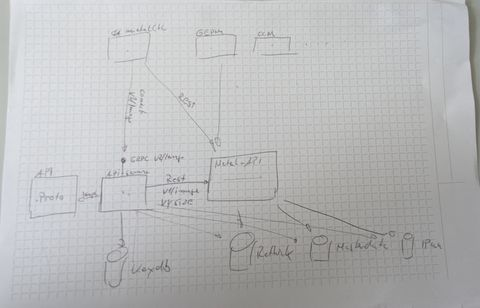

# Multi-tenancy for the metal-api

In the past we decided to treat the metal-api as a "low-level API", i.e. the API does not know anything about projects and tenants. A user with editor access can for example assign machines to every project he desires, he can see all the machines available and control them. Even though we always wanted to keep open the possibility to just offer bare metal machines to the end-user, the ultimate objective has always been to create an API for Kubernetes clusters. Hence, we tried to keep the metal-api code base as small as possible and we added resource scoping to a "higher-level APIs". From there, a user would be able to only see his own clusters and IP addresses.

The implication is that the metal-api has no multi-tenancy without another layer on top of it that implements resource scoping. One can say that we treat clusters as first-class citizens. In regard of clusters we fulfill the objective that we had from the very beginning: provide a multi-tenant API for Kubernetes clusters to the end-users.

However, as time passed by, things changed: The metal-stack is becoming an open-source product and we already have promising adopters of our product, who are willing to contribute to metal-stack. This is a serious chance of making our product better and more successful. It turns out that the decision we made was sufficient for us, but for others it is not.

## Why adopters need multi-tenancy in the metal-api

### Gardener Users

For example, users who want to combine the Metal Stack with Gardener, may not want to hide all of the Gardener's functionality behind. They want to use the much more powerful Gardener Dashboard instead. It only needs to utilize our "low-level API" and actually expects this API to have multi-tenancy as otherwise every logged in user can create / destroy clusters in every existing project from the Gardener dashboard.

This makes obvious that, with our decision, we placed an unnecessary obstacle in the way of our adopters: They now need to implement an own layer between the Gardener and the metal-api to provide multi-tenancy. From the Gardener-perspective we strongly differ from other cloud providers in this aspect and it is a matter of time when this will become an issue. When we encourage adopters to implement such interfaces on their own we also partly lose control of our product, we increase divergence.

### Open partitions for third-party usage

If a third-party uses Gardener and our metal-api had multi-tenancy, we would be able to allow a third-party to create clusters with workers in our own partitions. At the moment, this is not possible because the Gardener needs to know the HMAC secrets to create worker nodes, which would compromise our environment. If a thirdy-party knows our HMAC we lose control over the machines of our own tenants.

### Increased security for provider admins

Multi-tenancy in the metal-api also has the potential to limit the damage that a provider administrator can cause by mistake. If an administrator has to acquire project permissions on machine-level we can effectively reduce the damage he can make to this single project.

Another example would be the automatic provisioning of a Gitlab CI runner used for integration testing (a use case that we have where we do not require the cloud-api). This can easily be done in automated manner with Ansible and the Metal dynamic inventory + modules. However, with Ansible, mistakes in the automation can be made very quickly and if Ansible would only see machines of a dedicated project, this would also reduce damage it can make.

It is likely that there are more similar use-cases like that to come (maybe even for the storage solution?).

Also the surface for our Gardener components (metal-ccm, gardener-extension-provider-metal, machine-controller-manager) would be reduced to project scopes.

## Conclusion

For these reasons the decision we made is very likely to have a negative impact on the adoption-rate of the Metal Stack and we should think about treating machines, networks and ips as first-class citizens as well. This makes us closer to the offer of hyperscalers. As mentioned in the beginning, all the time we tried to keep the possibility open to just offer bare metal machines. Let's continue with decision by adding multi-tenancy to the metal-api.

## Implementation Proposal

We gathered a lot of knowledge while implementing the backend for metalstack.cloud. The goal is now to use the same technology and adopt that to the metal-api.
To make this transition as smooth as possible we propose the following steps.

Create a the following repositories in the metal-stack org

### API

This contains the `proto3` specification of the exposed metal-stack api. This includes the messages, simple validations, services and the access permission to these services. Client implementation for the most relevant languages (go, python) are generated automatically. Also the input parameters for the authorization in the backend is generated from the `proto3` annotations.

This api is divided into end user and admin access at the top level.

Proposed api is `metal-stack.io/v2`

Github Repo: `github.com/metal-stack/api`

### API Server

Implements the services defined in the api and validate access to a service is validated using OPA and JWT Tokens passed in the request. The server is implemented using the connectrpc.com framework.

JWT Tokens are stored in a redis compatible backend to have the ability to create Access Tokens for CI/CD or other use cases.
A JWT Token can be issued from a login at a OIDC provider, or from the built in http endpoint.
JWT Tokens can be revoked by admins and the user itself.

Exposed API Packages:

- api: for end user facing services
- admin: for operators and controllers which need access to unscoped entities

Github Repo: `github.com/metal-stack/api-server`

### Metal API

The business logic in the metal-api must stay the same for maximum compatibility for the consumers which are not yet migrated to the new `v2` api. To achieve this with it is required to extract the backend implementation, currently the `cmd/internal` package should be factored out to a consumable repository at `github.com/metal-stack/api-server/pkg/`.

### RethinkDB

We will try to migrate the rethinkdb backend implementation to a generic approach during this effort.

### Deployment

In the control-plane both apis are deployed side by side behind the ingress. `api.metal-stack.dev` is forwarded to `metal-api` and `metal.metal-stack.dev/` is forwarded to the new `api-server`.

### Migration of the consumers

There are a lot of consumers of metal-api:

- ansible
- firewall-controller
- firewall-controller-manager
- gardener-extension-auth
- gardener-extension-provider-metal
- machine-controller-manager-provider-metal
- metal-ccm
- metal-console
- metal-bmc
- metal-core
- metal-hammer
- metal-image-cache-sync
- metal-images
- metal-metrics-exporter
- metal-networker
- metalctl
- pixie

With the approach that both apis, the new and the old, are deployed in parallel, the consumers can be migrated to the `v2` api gradually.
