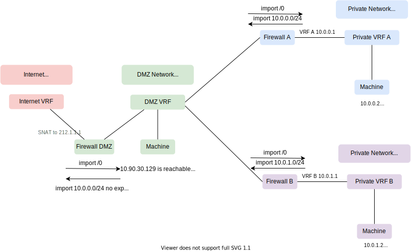

# DMZ Networks

## Reasoning

To fulfill higher levels of security measures the standard metal-stack approach with a single firewall in front of a set of machines might be insufficient.
There are cases where two physically distinct firewalls in front of application workload are mandatory. In traditional network terms this is known as DMZ approach.

For Kubernetes workloads it makes sense to use the front cluster for ingress, WAF purposes and as outgoing proxy. The clusters may be used for application workload.

## DMZ network

- Use a separate DMZ network prefix for every tenant
- This is used as intermediate network btw. private networks of a tenant and the internet
- For every partition a distinct DMZ firewall/cluster is needed for a tenant
- For Gardener orchestrated Kubernetes clusters this network must be a publicly reachable internet prefix because shoot clusters need a vpn service that is used for instrumentation from the seed cluster - this will be a requirement as long as the inverse vpn tunnel feature Konnectivity is not available to us.

## Approach 1: DMZ with publicly reachable internet prefix


A DMZ network with publicly reachable internet prefix will look like this in the metal-api:

```yaml
---
description: DMZ-Network
destinationprefixes:
- 0.0.0.0/0
id: dmz
labels:
  network.metal-stack.io/default-external: ""
name: DMZ-Network
parentnetworkid: null
partitionid: ""
prefixes:
- 212.90.30.128/25
privatesuper: false
projectid: ""
vrf: 104007
vrfshared: false
nat: true
shared: false
underlay: false
```

### DMZ firewall

The firewall of the DMZ will intersect its private network for attached machines, the DMZ network and the public internet.

- The private network of the project needs to import
   - the default route from the internet network
   - the DMZ network
- The internet network must import the DMZ network
- The DMZ network provides the default route for a tenant's clusters in a partition. It imports the default route from the internet network

### Application Firewall

The firewall of application workloads intersects its private network for attached machines and the DMZ network.

This is currently supported by the metal-networker and needs no further changes!

## Approach 2: DMZ with private IPs



A DMZ network with private IPs will look like this in the metal-api:

```yaml
---
description: DMZ-Network
destinationprefixes:
- 0.0.0.0/0
id: dmz
labels:
  network.metal-stack.io/default-external: ""
name: DMZ-Network
parentnetworkid: tenant-super-network-fra-equ01
partitionid: fra-equ01
prefixes:
- 10.90.30.128/25
privatesuper: false
projectid: ""
vrf: 4711
vrfshared: false
nat: false
shared: true # it's usable from multiple projects
underlay: false
```

### DMZ firewall

The firewall of the DMZ will intersect its private network for attached machines, the DMZ network and the public internet.

- The private network of the project needs to import
   - the default route from the internet network
   - the DMZ network
- The internet network must import the DMZ network (only locally, no-export)
- The DMZ network provides the default route for a tenant's clusters in a partition. It imports the default route from the internet network

### Application Firewall

The firewall of application workloads intersects its private network for attached machines and the DMZ network. 

## Code Changes

- metal-networker and metal-ccm assume that there is only one network providing the default-route
- metal-networker needs to
   - import the default route from the internet network to the dmz network (DMZ Firewall)
   - import the DMZ network to the internet network and adjusting NAT rules (DMZ Firewall)
   - import destination prefixes of the DMZ network to the private primary network (DMZ Firewall, Application Firewall)
   - import DMZ-IPs of the private primary network to the DMZ network (DMZ Firewall, Application Firewall)
