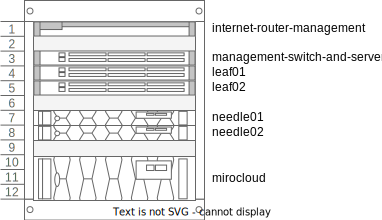

# Autonomous Control Plane, aka solve the bootstrap problem

Setting up a metal-stack.io environment in your own datacenter requires a control plane to be present which hosts the metal-stack api.
If you plan to spin up kubernetes clusters, either with gardener.cloud or cluster api, the requirement for this control plane raises.
The control plane must be running in a kubernetes cluster, which offers at least the following features:

- Loadbalancing
- Persistent Storage
- Access to a object storage for automatic backups of the stateful sets
- Access to a DNS provider which is supported by one of the dns extensions in use.

This cluster must also be highly available to prevent complete loss of control over the managed resources in the datacenter.
Regular kubernetes updates to apply security fixes and feature updates must be possible in a automated manner.

The most obvious and simple solution is to use one of the managed kubernetes offerings from another cloud provider.

But there are use cases, where it is not possible because of network restrictions, or because the company compliances does forbidd the usage of external datacenter products.
For such cases a solution must be found which produces the control plane inside the own datacenter but with reasonable day two operational effort.

```@contents
Pages = ["autonomous-control-plane.md"]
Depth = 5
```

## Possible Solutions

No complete list.

- vmware and rancher
- talos
- 3 physical machines with kubespray
...

All of these solutions add another stack which is probably new to the team which already operates the metal-stack environment.

TODO: can we provide a list which of the requirements can be solved with all of the alternatives.

## Use your own dogfood

With metal-stack.io we already have the possibility to create an manage kubernetes cluster with the help of gardener.cloud.
Use this stack to create the control plane clusters only. Do not try to create more clusters for other purposes than metal-stack control planes.
If this restriction applies, the requirement for a control plane for this metal-stack setup can be minimal.

This metal-stack setup also requires a control plane to host metal-api and gardener, but this control plane does not have huge resource requirements in terms of cpu, memore and storage.
For this initial control plane cluster we could use [kind](https://kind.sigs.k8s.io/) running on a single server which manages the initial metal-stack partitin to host the control plane for the real setup.

This is a chain of two metal-stack environments.

### Architekture

A high-level architecture consists of two metal-stack.io environments, one for the control plane, the second one for the production or real environment. It might also be possible to call the initial metal-stack.io environment the metal-stack `seed`, and the actual production environment the metal-stack `shoot`.

We could even use some names for this environments which match better to metal, like `needle` and `nail`. So, a `needle` metal-stack is used to create a `nail` metal-stack environment.


The `needle` and the `nail` metal-stack have both a control plane and a set of physical bare metal machines they manage and operate on.

#### Needle

The `needle` control plane is kept very small and running inside a `kind` cluster. The physical bare metal machines can be any machines and switches which are supported by metal stack, but can be smaller in terms of cpu, memory and network speed, because these machines must only be capable of running the `nail` metal stack control plane.

1. Control Plane

In the most simple case the `needle` control plane is based on `kind` which is running on a machine which was setup manually/partly automated with a debian:12 operating system.
This machine provides a decent amount of cpu, memory and storage locally to store all persistent data. The amount of cpus and memory depends on the required size of the expected `nail` control plane. A typical single socket server with 8-16 cores and 64GB of RAM and two NVMe drives of 1TB would be a good starting point.

In a typical `kind` setup, a stateful set would loose the data once the `kind` cluster was terminated and started again. But there is a possibility to define parts of the local storage of the server to be provided to the `kind` cluster for the PVCs. With that, `kind` could be terminated and started again, for example to update and reboot the host os, or update `kind` itself and the data will persist.

Example `kind` configuration for persistent storage on the hosts os:

```yaml
kind: Cluster
apiVersion: kind.x-k8s.io/v1alpha4
name: needle-control-plane
nodes:
- role: control-plane
  # add a mount from /path/to/my/files on the host to /files on the node
  extraMounts:
  - hostPath: /path/to/my/files
    containerPath: /files

```

As mentioned before, `kind` is used to host the `needle` control plane. For a gardener managed kubernetes setup, metal-stack and gardener will be deployed into this cluster. This deployment can be done by a gitlab runner which is running on this machine.
The mini-lab will be used as a base for this deployment. The current development of [gardener-in-minilab](https://github.com/metal-stack/mini-lab/pull/202) must be extended to host all required extensions to make this a working metal stack control plane which can manage the machines in the attached bare metal setup.

A second `kind` cluster is started on this machine to host services which are required to complete the service. A non-complete list would be:

- PowerDNS to server as a DNS Server for all dns entries which needs to be created in the needle, like api.needle.metal-stack.local, gardener-api.needle.metal-stack.local and the dns entries for the api servers of the create kubernetes clusters.
- NTP
- Monitoring for the `needle` partition ?
- Optional: Container Registry to host all metal-stack and gardener containers
- Optional: Letsencrypt [boulder](https://github.com/letsencrypt/boulder) as a certificate authority
- ...


1.1. Control Plane High Availability

Running the `needle` control plane on a single physical server is not as available as it should be in such a use case. It should be possible to survive a loss of this server, because the server could be lost by many events, such as hardware failure, disk corruption or even failure of the datacenter location where this server is deployed.

Setting up a second server with the same software components is an option, but the problem of data redundancy must be solved, because neither the gardener control plane, nor the metal-stack control plane can be instantiated twice.

Given that we provide part of the local storage of the server as backing storage for the stateful sets in the `kind` cluster, the data stored on the server itself must be synced to a second server in some way.

Her comes [DRBD](https://github.com/LINBIT/drbd) into play, this is a linux kernel module which can be configured to mirror one or more local block devices to another server connected over tcp. With the help of [pacemaker](https://clusterlabs.org/projects/pacemaker/) a coordinated failover of resources running on top of filesystems created on such replicated drbd devices, a high available statefule server pair is possible. It is also possible to prevent split brain if both servers have a out-of-band management build in with power off capability.
DRBD can also be configured to sync storage between WAN links with a higher latency by using a async mechanism.

Sample drbd configuration:

```conf
resource needle-control-plane {
  meta-disk internal;
  device /dev/drbd0;
  syncer {
    verify-alg sha1;
  }
  net {
    allow-two-primaries;
  }
  on needle1 {
    disk /dev/nvme0n1;
    address 192.168.1.101:7789;
  }
  on needle2 {
    disk /dev/nvme0n1;
    address 192.168.1.102:7789;
  }
}
```

TODO: LVM Volumes

Logical View


Physical View, minimal ha setup which is only suitable for 1 Seed and 1 Shoot



Physical View, bigger ha setup which is spread to two datacenters, capable to create 1 Seed with 3 nodes and 2 Shoots with 3 nodes each and still 2 waiting machines.


1. Partition

The partition which is managed by the metal-stack `needle` can be a simple and small hardware setup but yet capable enough to host the metal-stack `nail` control plane.
It can follow the metal-stack minimal setup which provides about 8-16 small servers connected to a 1G/s or 10G/s network dataplane. Central storage is optional as the persistence of the services running in these clusters is always backed up to a central object storage. Operations would be much easier if a central storage is provided.

A seed must be created which is responsible for hosting the control planes of the shoots in this partition. The amount of shoots should be minimal, most of the time, two shoots, one for hosting gardener and one for metal-stack.


1. Network Diagram

TODO: Where to connect the `needle` servers

## Open Topics

- Naming of the metal-stack chain elements, is `needle` and `nail` appropriate ?
- Storage in the `needle` partition
  - [MinIO DirectPV](https://min.io/docs/directpv/) --> new to me, dont know exactly how this works, looks interesting
  - lightOS
  - [Diskomator](https://github.com/poettering/diskomator) --> Crazy
  - the needle server as initiator, maybe also replicated with drbd ?
    - [NVMEoTCP Howto](https://ssdcentral.net/getting-started-with-nvme-over-fabrics-with-tcp/)
    - [NVMEoTCP Howto](https://jing.rocks/2023/06/13/Experimenting-with-NVMe-over-TCP.html)
  - Storage Appliance like Synology
- S3 Object storage is considered as provided
- AirGapped is out of scope for now
- IP address ranges and families
- Consider [Autonomous Shoots](https://github.com/gardener/gardener/blob/master/docs/proposals/28-autonomous-shoot-clusters.md) for the `needle` `seed`
- Take a look at: [Description of a Microdatacenter](https://github.com/robgil/microdatacenter)
